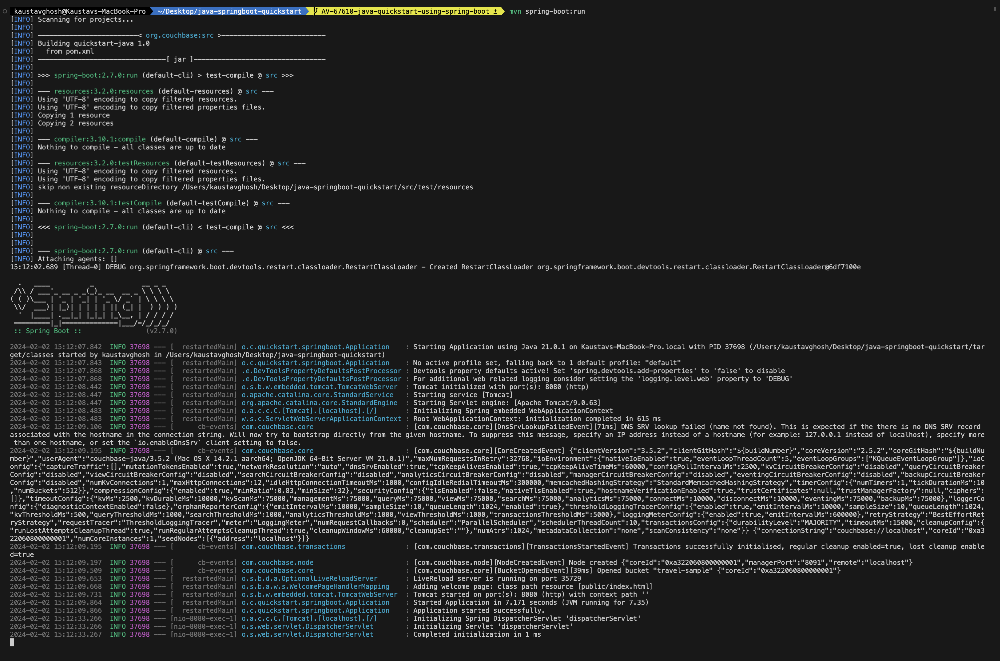
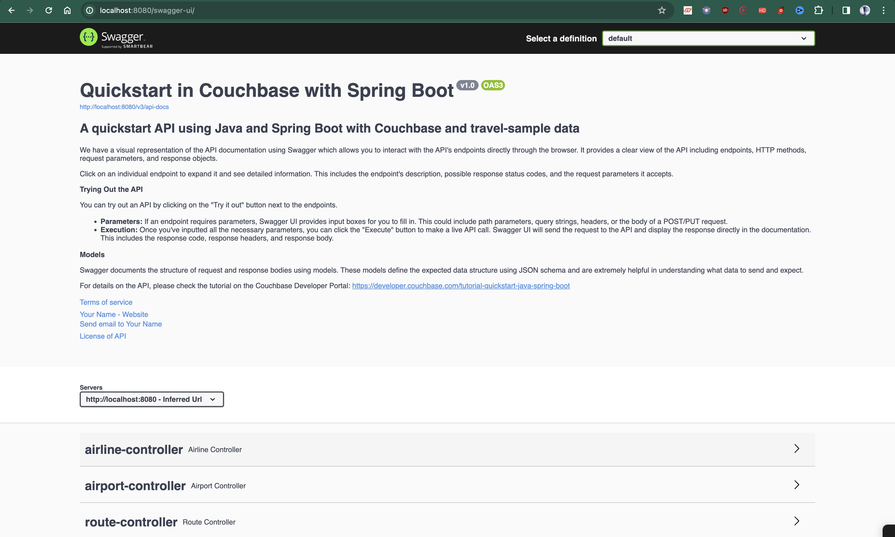

# Quickstart in Couchbase with Spring Boot and Java

#### REST API using Couchbase Capella in Java using Spring Boot

Often, the first step developers take after creating their database is to create a REST API that can perform Create, Read, Update, and Delete (CRUD) operations for that database. This repo is designed to teach you and give you a starter project (in Java using Spring Boot) to generate such a REST API. After you have loaded the travel-sample bucket in your database, you can run this application which is a REST API with Swagger documentation so that you can learn:

1. How to create, read, update, and delete documents using Key-Value[ operations](https://docs.couchbase.com/java-sdk/current/howtos/kv-operations.html) (KV operations). KV operations are unique to Couchbase and provide super fast (under millisecond) operations.
2. How to write simple parametrized [N1QL queries](https://docs.couchbase.com/java-sdk/current/howtos/n1ql-queries-with-sdk.html) using the built-in travel-sample bucket.

Full documentation for the tutorial can be found on the [Couchbase Developer Portal](https://developer.couchbase.com/tutorial-quickstart-java-springboot/).

## Prerequisites

To run this prebuilt project, you will need:

- [Couchbase Capella](https://www.couchbase.com/products/capella/) cluster with [travel-sample](https://docs.couchbase.com/java-sdk/current/ref/travel-app-data-model.html) bucket loaded.
  - To run this tutorial using a self-managed Couchbase cluster, please refer to the [appendix](#running-self-managed-couchbase-cluster).
- [Java SDK 17+](
  - Ensure that the Java version is compatible with the Couchbase SDK. [Please check the link for compatibility](https://docs.couchbase.com/java-sdk/current/project-docs/compatibility.html#jdk-compat)
- Loading Travel Sample Bucket:
  - If `travel-sample` is not loaded in your Capella cluster, you can load it by following the instructions for your Capella Cluster. [Load travel-sample bucket in Couchbase Capella](https://docs.couchbase.com/cloud/clusters/data-service/import-data-documents.html#import-sample-data)
- [Maven 3.6.3+](https://maven.apache.org/install.html)

## App Setup

We will walk through the different steps required to get the application running.

### Cloning Repo

```shell
git clone https://github.com/couchbase-examples/java-springboot-quickstart.git
```

### Navigate to the Project Directory

```shell
cd java-springboot-quickstart
```

### Install Dependencies

The dependencies for the application are specified in the `pom.xml` file in the root folder. Dependencies can be installed through `mvn` the default package manager for Java.

```
mvn clean install -DskipTests=true
```

Note: The `-DskipTests=true` option is used to skip the tests. The tests require the application to be running.

Note: The application is tested with Java 17 and 21. If you are using a different version of Java, please update the `pom.xml` file accordingly.

### Setup Database Configuration

To learn more about connecting to your Capella cluster, please follow the [instructions](https://docs.couchbase.com/cloud/get-started/connect.html).

Specifically, you need to do the following:

- Create the [database credentials](https://docs.couchbase.com/cloud/clusters/manage-database-users.html) to access the travel-sample bucket (Read and Write) used in the application.
- [Allow access](https://docs.couchbase.com/cloud/clusters/allow-ip-address.html) to the Cluster from the IP on which the application is running.

All configuration for communication with the database is read from the application properties. We have provided a convenience feature in this quickstart to read the properties from a local file, `application.properties` in the `src/main/resources` folder.

```properties
spring.mvc.pathmatch.matching-strategy=ANT_PATH_MATCHER
spring.couchbase.bucket.name=travel-sample
spring.couchbase.bootstrap-hosts=DB_CONN_STR
spring.couchbase.bucket.user=DB_USERNAME
spring.couchbase.bucket.password=DB_PASSWORD
```

Instead of the DB_CONN_STR, DB_USERNAME and DB_PASSWORD, you need to add the values for the Couchbase connection.

> Note: The connection string expects the `couchbases://` or `couchbase://` part.

You can also use your system environment variables to set the properties. The properties are read from the environment variables if they are set. The properties are read from the `application.properties` file if the environment variables are not set.

## Running The Application

You can add environment variables DB_CONN_STR, DB_USERNAME and DB_PASSWORD to your system environment variables or you can update the `application.properties` file in the `src/main/resources` folder.

### Directly on Machine

At this point, we have installed the dependencies, loaded the travel-sample data and configured the application with the credentials. The application is now ready and you can run it.

```sh
mvn spring-boot:run
```

### Using Docker

Build the Docker image

```sh
docker build -t java-springboot-quickstart .
```

Run the Docker image

```sh
docker run -d --name springboot-container -p 9440:8080 java-springboot-quickstart -e DB_CONN_STR=<connection_string> -e DB_USERNAME=<username> -e DB_PASSWORD=<password>
```

Note: The `application.properties` file has the connection information to connect to your Capella cluster. You can also pass the connection information as environment variables to the Docker container.
If you choose not to pass the environment variables, you can update the `application.properties` file in the `src/main/resources` folder.

### Verifying the Application

Once the application starts, you can see the details of the application on the logs.



The application will run on port 8080 of your local machine (http://localhost:8080). You will find the interactive Swagger documentation of the API if you go to the URL in your browser. Swagger documentation is used in this demo to showcase the different API endpoints and how they can be invoked. More details on the Swagger documentation can be found in the [appendix](#swagger-documentation).



## Running Tests

To test your application, you can use Maven (mvn) to run the test suite. Here are the steps to run the tests:

### Run All Tests:

```sh
mvn test
```

This command will execute all the test cases in your project.

### Run Individual Tests:

Additionally, you can run individual test classes or methods using the following commands:

To run the tests for the AirlineIntegrationTest class:

```sh
mvn test -Dtest=org.couchbase.quickstart.springboot.controllers.AirlineIntegrationTest
```

To run the tests for the AirportIntegrationTest class:

```sh
mvn test -Dtest=org.couchbase.quickstart.springboot.controllers.AirportIntegrationTest
```

To run the tests for the RouteIntegrationTest class:

```sh
mvn test -Dtest=org.couchbase.quickstart.springboot.controllers.RouteIntegrationTest
```

## Appendix

### Data Model

For this quickstart, we use three collections, `airport`, `airline` and `routes` that contain sample airports, airlines and airline routes respectively. The routes collection connects the airports and airlines as seen in the figure below. We use these connections in the quickstart to generate airports that are directly connected and airlines connecting to a destination airport. Note that these are just examples to highlight how you can use SQL++ queries to join the collections.


### Extending API by Adding New Entity

If you would like to add another entity to the APIs, these are the steps to follow:

- Create a new collection in the Couchbase scope. You can create new collections using the [SDK](https://docs.couchbase.com/java-sdk/current/howtos/provisioning-cluster-resources.html#collection-management) or via the [Couchbase Server interface](https://docs.couchbase.com/cloud/n1ql/n1ql-language-reference/createcollection.html).
- Define the routes in a new class in the `controllers` package similar to the existing routes like `AirportController.java`.
- Define the service in a new class in the `services` package similar to the existing services like `AirportService.java`.
- Define the repository in a new class in the `repositories` package similar to the existing repositories like `AirportRepository.java`.

### Running Self-Managed Couchbase Cluster

If you are running this quickstart with a self-managed Couchbase cluster, you need to [load](https://docs.couchbase.com/server/current/manage/manage-settings/install-sample-buckets.html) the travel-sample data bucket in your cluster and generate the credentials for the bucket.

You need to update the connection string and the credentials in the `application.properties` file in the `src/main/resources` folder.

Note: Couchbase Server version 7 or higher must be installed and running before running the Spring Boot Java app.

### Swagger Documentation

Swagger documentation provides a clear view of the API including endpoints, HTTP methods, request parameters, and response objects.

Click on an individual endpoint to expand it and see detailed information. This includes the endpoint's description, possible response status codes, and the request parameters it accepts.

#### Trying Out the API

You can try out an API by clicking on the "Try it out" button next to the endpoints.

- Parameters: If an endpoint requires parameters, Swagger UI provides input boxes for you to fill in. This could include path parameters, query strings, headers, or the body of a POST/PUT request.

- Execution: Once you've inputted all the necessary parameters, you can click the "Execute" button to make a live API call. Swagger UI will send the request to the API and display the response directly in the documentation. This includes the response code, response headers, and response body.

#### Models

Swagger documents the structure of request and response bodies using models. These models define the expected data structure using JSON schema and are extremely helpful in understanding what data to send and expect.
